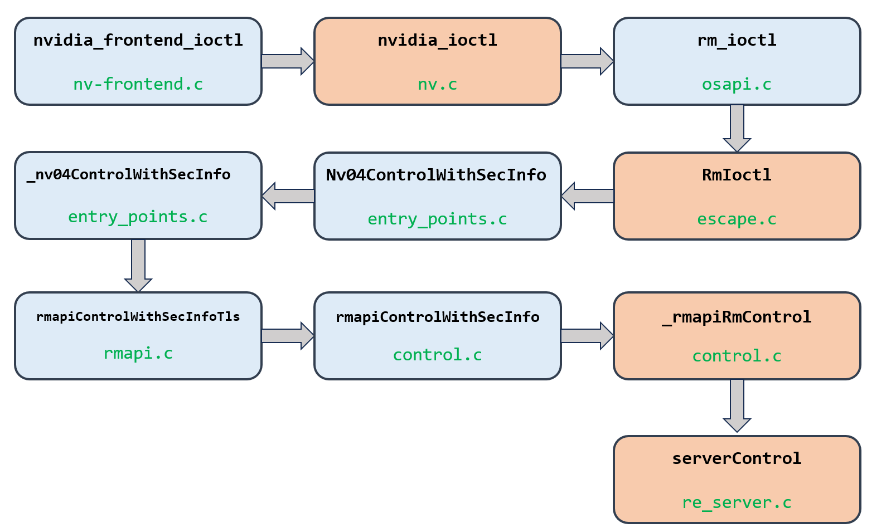

# NV_ESC_RM_CONTROL

escape.c 中 cmd 进入的宏，testkernel 的 launch kernel 时共执行了 62 次 ioctl，这个宏进入了 55 次

## 0 执行路径



## 1 escape.c

在 escape.c 中，并没有进入 if，所以核心调用就是 `Nv04ControlWithSecInfo(pApi, secInfo);`

这个函数位于 entry_points.c

## 2 entry_points.c

在这个代码文件中，`Nv04ControlWithSecInfo` 调用了 `_nv04ControlWithSecInfo`

而后者也是在本代码文件中实现的

#### 2.1 _nv04ControlWithSecInfo

处理 Nvidia 驱动程序的控制命令

首先尝试获取一个 Deprecated 的 Handler，如果获取成功，则创建一个 context 并调用这个 Handler，如果获取不成功，则调用 `rmapiGetInterface`

在 testkernel 中，每次都是进入 else，即调用 `rmapiGetInterface`，且每次传的参数都是 0，即 `RMAPI_EXTERNAL`

关键代码：

```c
RM_API *pRmApi = rmapiGetInterface(bInternalCall ? RMAPI_MODS_LOCK_BYPASS : RMAPI_EXTERNAL);

pArgs->status = pRmApi->ControlWithSecInfo(pRmApi, pArgs->hClient, pArgs->hObject, pArgs->cmd, pArgs->params, pArgs->paramsSize, pArgs->flags, &secInfo);
```

所以，接下来需要分析：

+ rmapiGetInterface(RMAPI_EXTERNAL)
+ pRmApi->ControlWithSecInfo

## 3 rmapiGetInterface(RMAPI_EXTERNAL)

位于 rmapi.c

只有一行代码：

```c
return &g_RmApiList[rmapiType];
```

`rmapiType` 是传入的参数，在此处为 RMAPI_EXTERNAL，即 0

那么返回的其实是：

> 阅读代码可知，g_RmApiList 的内容是在函数 `_rmapiInitInterface` 中填充的
>
> 对于 RMAPI_EXTERNAL 的填充是
>
> ```c
> _rmapiInitInterface(&g_RmApiList[RMAPI_EXTERNAL],         
>                     NULL	 /* pDefaultSecInfo */,   
>                     NV_FALSE /* bTlsInternal */,  
>                     NV_FALSE /* bApiLockInternal */, 
>                     NV_FALSE /* bGpuLockInternal */);
> ```
>
> 总之是定义了一堆 API 的入口

所以 rmapiGetInterface 就是返回了一些 API 的入口

而即将被调用的 `pRmApi->ControlWithSecInfo`，则是：

`rmapiControlWithSecInfoTls`

## 4 rmapiControlWithSecInfoTls

本来此处应该分析 `pRmApi->ControlWithSecInfo`

根据上述分析，此处实际是函数 `rmapiDupObjectWithSecInfoTls`，所以直接分析此函数：

该函数首先检查是否可以执行非分页内存分配，如果不可以，则函数调用 `_rmapiControlWithSecInfoTlsIRQL` 并 return。如果可以，使用 `threadStateInit` 初始化线程状态，调用 `rmapiControlWithSecInfo`，传递所有参数来执行实际的控制命令，使用 `threadStateFree` 清理线程状态。

位于 control.c

此处并没有进入 if，即「可以执行非分页内存分配」，所以核心代码为：

```c
threadStateInit(&threadState, THREAD_STATE_FLAGS_NONE);
status = rmapiControlWithSecInfo(pRmApi, hClient, hObject, cmd, pParams, paramsSize, flags, pSecInfo);
threadStateFree(&threadState, THREAD_STATE_FLAGS_NONE);
```

那么接下来需要分析 `rmapiControlWithSecInfo`

## 5 rmapiControlWithSecInfo

位于 control.c

关键代码就一句：

```c
status = _rmapiRmControl(hClient, hObject, cmd, pParams, paramsSize, flags, pRmApi, pSecInfo);
```

而且每次的返回值都是 `NV_OK`

所以继续分析 `_rmapiRmControl`

## 6 _rmapiRmControl

位于 control.c

处理 Nvidia 设备的各种控制命令

> 函数中有几个 `if` 语句块，用于处理特定类型的命令（例如，提升的 IRQL 命令或绕过锁定的命令）
>
> // Three separate rmctrl command modes:
>
> //  mode#1: lock bypass rmctrl request
>
> //  mode#2: raised-irql rmctrl request
>
> //  mode#3: normal rmctrl request

打了 log，发现全部 55 次执行流程均一致：（标记在源码中）

简单来说就是并没有进入特殊类型的命令。中间会有一次 `portMemSet(&rmCtrlParams, 0, sizeof(rmCtrlParams));`。最后在 else 中（源码中的注释表明这里是「Normal rmctrl request」）。而且在 else 中也没有进入 if.

所以被调用的函数有：

+ `serverutilGetClientUnderLock(hClient)`：返回值不为 NULL
+ `rmapiutilGetControlInfo(cmd, &ctrlFlags, &ctrlAccessRight);`：返回值为 NV_OK
+ `rmapiPrologue(pRmApi, &rmApiContext);`
+ `serverControl(&g_resServ, &rmCtrlParams);`
+ `rmapiEpilogue(pRmApi, &rmApiContext);`

目前感觉应该是第四个是关键，先分析他。

## 7 serverControl

位于 re_server.c

执行逻辑：

验证锁信息（pLockInfo）并设置各种本地变量。

它执行一系列锁定操作，以确保对资源的线程安全访问。这包括顶层锁定、客户端锁定和会话锁定。 

它验证客户端和资源引用，确保它们处于活动状态且未失效

设置调用上下文（callContext），其中包括有关资源、客户端、服务器和控制参数的信息。

在控制命令执行期间，将当前线程的本地存储（TLS）调用上下文与新上下文进行交换。

控制命令执行，调用 `resControl(pResourceRef->pResource, &callContext, pParams);`

在执行命令后，还原原始的TLS调用上下文

执行后清理，包括释放锁定和处理任何必要的执行后逻辑

综上，关键的是 `resControl`

根据 log，55 次执行过程均一致，都顺利执行到 `resControl`

#### 跳转的目标函数分析

因为跳转到的函数实际是一个函数指针，所以并不能直接由 ctrl+click 确定。

但是这个函数指针总会有赋值的时候，所以定位名称「pResource」，实际是这个结构体变量的 `pResource->__resControl__`

直接在所有文件里搜索 `__resControl__`，找到了以下几个：

+ `&__nvoc_thunk_DisplayApi_resControl`
+ `&__nvoc_thunk_GpuResource_resControl`
+ `&__nvoc_thunk_GSyncApi_resControl`
+ `&__nvoc_thunk_Memory_resControl`
+ `&resControl_IMPL`

打 log，运行，结果为：

```log
NVRM __nvoc_thunk_GpuResource_resControl: ioctl 21: src: __resControl__ in g_gpu_resource_nvoc.c __nvoc_thunk_GpuResource_resControl
NVRM resControl_IMPL: ioctl 21: src: __resControl__ in re_resource.c resControl_IMPL
```

可以看到，是先进入 `__nvoc_thunk_GpuResource_resControl`，然后进入 `resControl_IMPL`

> 感觉有点奇怪，明明只调用了一次 `__resControl__`
>
> 后面又打 log 分析了一次，应该是调用的 `__nvoc_thunk_GpuResource_resControl`，后面这个，需要再分析才能确定是：
>
> + `__nvoc_thunk_GpuResource_resControl` 后续执行调用的
> + ~~其他函数调用的，和 ioctl 无关~~

## 8 __nvoc_thunk_GpuResource_resControl

只有一行，调用了 `gpuresControl`

## 9 gpuresControl

到这里，遇到了和 `__resControl__` 一样的问题。

关键是 `pGpuResource->__gpuresControl__`，那么，搜索 `__gpuresControl__`

+ `&__nvoc_thunk_BinaryApi_gpuresControl`
+ `&__nvoc_thunk_Device_gpuresControl`
+ `&__nvoc_thunk_GenericEngineApi_gpuresControl`
+ `&gpuresControl_IMPL`：这里会调用 `resControl_IMPL`
+ `&__nvoc_thunk_KernelChannelGroupApi_gpuresControl`
+ `&__nvoc_thunk_Profiler_gpuresControl`
+ `&__nvoc_thunk_DiagApi_gpuresControl`

目前看起来，只调用了 `gpuresControl_IMPL`

## 10 gpuresControl_IMPL

调用了两个函数：

+ `gpuresControlSetup(pParams, pGpuResource);`
+ `resControl_IMPL(staticCast(pGpuResource, RsResource), pCallContext, pParams);`

### 10.1 gpuresControlSetup

实际是 `gpuresControlSetup_IMPL`

调用了宏 `GPU_RES_SET_THREAD_BC_STATE(pGpuResource);`，这个宏实际是 `PORT_UNREFERENCED_VARIABLE`，然后，实际是 `((void)sizeof(&(x)))`

所以看起来这个函数只是做了几个设置

## 11 resControl_IMPL

位于 `re_source.c`

所以现在，55 次这个宏的核心逻辑都按完全相同的路径，执行到了这个函数

#### 执行逻辑：

在 Nvidia 驱动程序的服务器上下文中执行特定资源上的控制命令。

它处理了命令执行的各个阶段，包括查找、过滤、序列化和执行实际的控制命令

1. 首先执行控制命令的查找（resControlLookup），以找到导出方法表中相应的条目（pEntry）

2. 初始化执行cookie，并对控制命令进行过滤和序言操作

3. 根据 pEntry 中的类别 ID 将资源转换为动态对象类型

4. 根据参数的大小（paramSize），该函数调用适当的函数指针（pFunc）来执行控制命令
5. 在执行命令后，该函数执行资源控制和序列化的尾声操作
6. 调用 serverControl_Epilogue 来完成 server 端处理控制命令的工作

#### 日志分析

在这里，55 次执行有了不同：均能执行到 line before done

是在上面「执行逻辑」的 4 中，有两条路径：

+ 一是「Call handled by the prologue.」，共 20 次
+ 二是使用 pFunc 执行，共 35 次

继续分析第二条路经，其内部仍有两个分支，区别是参数个数，在此处，全部为有参数，所以均为 else。

执行的 pFunc 并不完全相同，包括：

+ -1053730448：15 次
+ -1053730544：20 次

**综上，55 次调用，在这里分成了三组：**

+ 「Call handled by the prologue.」，共 20 次
+ pFunc = -1053730448：15 次
+ pFunc = -1053730544：20 次

